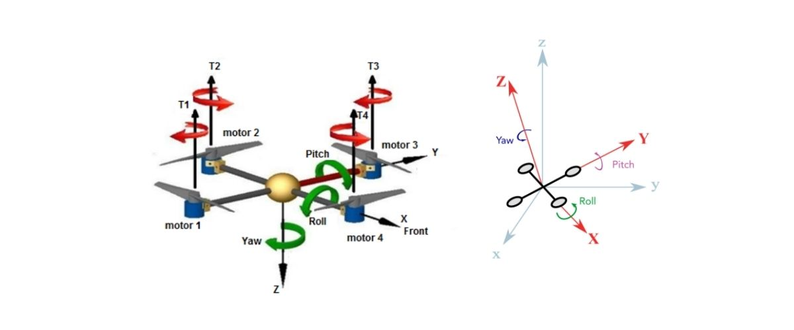

<h1 align="center">
  Projeto de Extensão - Modelagem e Construção de um Drone Quadricóptero 
</h1>

<h3 align="center">
  Universidade Federal do Pará  
  Campus Universitário de Tucuruí  
  Faculdade de Engenharia Elétrica   
</h3>

<h1 align="center">
  
</h1>

<h2>
  Objetivo
</h2>

  O intuito desse projeto de extensão é ajudar quem está dando os
  primeiros passos na modelagem de um drone Quadricópitero, dando a essa pessoas 
  uma visão das etapas necessárias para a modelagem completa de um 
  Quadricóptero.

