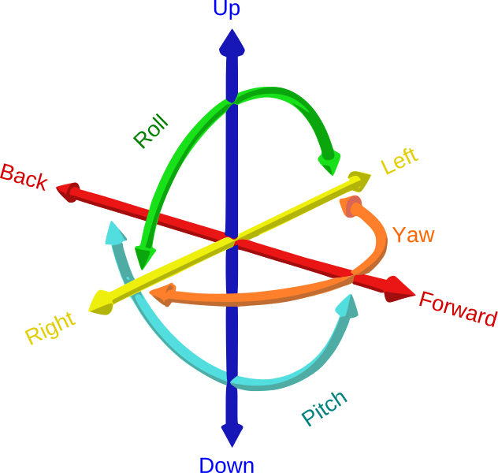

# Modelagem Dinâmica do Drone Quadricóptero

Modelagem dinâmica de um drone Quadricóptero

 

---
 

## 6 Graus de Liberdade [ Six Degrees of Freedom (6DOF)]

É o máximo que um corpo livre tem de liberdade de movimento!

<h1 align="center">
  
</h1>