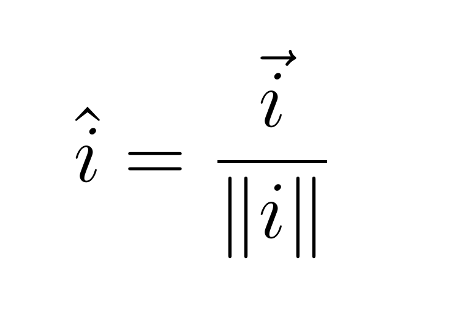
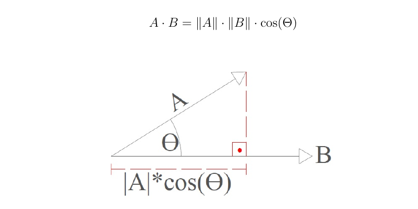
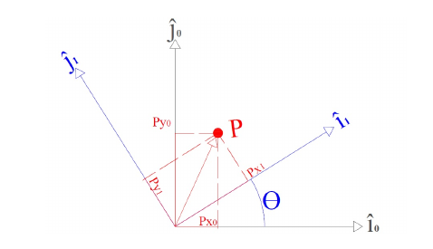
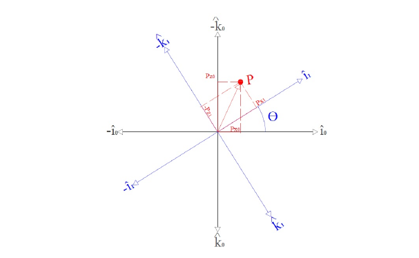
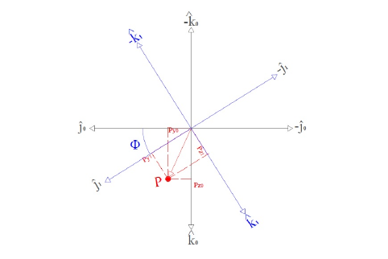

# Modelagem Matemática - Drone Quadricóptero

Modelagem Matemática de um drone Quadricóptero

 

---
 

## Vetores Unitários

O conceito de vetor unitário consiste em dividir suas coordenadas pelo seu módulo.

<h1 align="center">
  
</h1>

## Produto Escalar

O produto escalar de dois vetores A e B é o resultado da multiplicação do comprimento de ambos e resulta um número real, o resultado dessa operação é diretamente ligada com o cosseno do ângulo formado entre eles.

<h1 align="center">
  
</h1>

## Matriz de Rotação em três Dimensões
Quando refere-se a um plano em três dimensões considera-se normalmente as coordenadas x, y e z, que são representados por ^ i, j ^ e ^ k, respectivamente, os eixos  são considerados unitários.

 

### Mantendo o eixo z constante

 

<h1 align="center">
  
</h1>

### Mantendo o eixo y constante

 

<h1 align="center">
  
</h1>

### Mantendo o eixo x constante

 

<h1 align="center">
  
</h1>