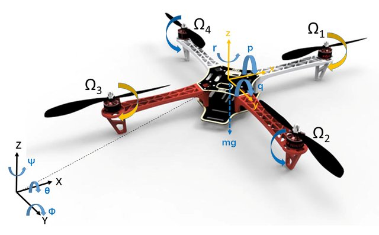
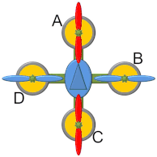

# O que é um Drone Quadricóptero?
### Entendendo o conceito por trás de um Quadricóptero!  

<h1 align="center">
  
</h1>

 Um QuadRotor ou Quadricóptero tem como característica  possuir quatro moteres capazes de gerar empuxo através de hélices fixadas em cada motor, de modo a impulsionar o veículo verticalmente.  

<h1 align="center">
  
</h1>

