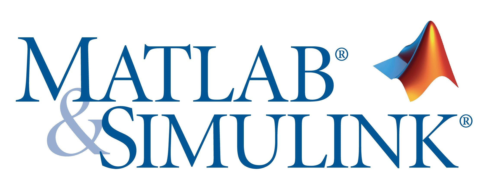

# Simulação Dinâmica do Quadricóptero Usando o Matlab

Vamos Criar um modelo Linear do nosso Modelo Dinâmico e simular usando o Software Simulink do Matlab  

---
 

## O que é Matlab?

## O que é Simulink?

É o máximo que um corpo livre tem de liberdade de movimento!

<h1 align="center">
  
</h1>